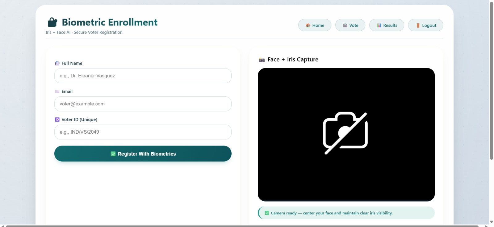
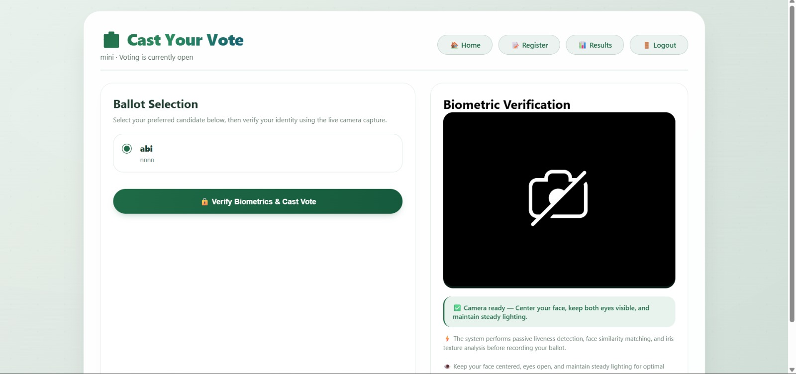

# 🗳️ Secure Electronic Voting System Using Face Recognition and Iris Authentication with CNN-Based Verification

## 📖 Overview

The Secure Electronic Voting System is a biometric-based digital voting platform designed to improve election security, transparency, and reliability. The system authenticates each voter using both Face Recognition and Iris Authentication before allowing vote submission. By integrating CNN-based biometric verification, the application minimizes unauthorized access, duplicate voting, and identity fraud while ensuring a secure and efficient voting process.

---

## 🎯 Objectives

* Develop a secure electronic voting platform using biometric authentication.
* Verify voter identity through Face Recognition and Iris Authentication.
* Prevent duplicate voting and unauthorized access.
* Improve transparency and reliability in digital elections.
* Securely manage voter information and voting records.

---

## ✨ Features

* Secure Voter Registration
* Face Recognition Authentication
* Iris Recognition Authentication
* Dual Biometric Verification
* Secure Vote Casting
* Duplicate Vote Prevention
* Election Management Dashboard
* Real-Time Voter Verification
* Protected Data Storage

---

## 🛠️ Technologies Used

* Python
* Django
* HTML
* CSS
* JavaScript
* OpenCV
* CNN (Convolutional Neural Network)
* MTCNN
* FaceNet
* MediaPipe
* NumPy
* SQLite

---

## 🏗️ System Architecture

The application follows a secure biometric verification workflow:

1. Voter Registration
2. Face Recognition Verification
3. Iris Authentication
4. Identity Validation
5. Secure Vote Casting
6. Vote Storage
7. Election Result Processing

---

## 📂 Modules

### 👤 Voter Registration Module

* Registers voter information securely.
* Captures face and iris biometric data.
* Prevents duplicate voter registration.
* Stores voter records safely.

### 😊 Face Recognition Module

* Detects the user's face using live camera input.
* Extracts facial features using deep learning.
* Matches facial data with registered records.
* Performs real-time identity verification.

### 👁️ Iris Authentication Module

* Captures iris images during authentication.
* Extracts iris biometric features.
* Verifies iris patterns with stored records.
* Provides an additional layer of authentication.

### 🗳️ Secure Voting Module

* Allows voting only after successful authentication.
* Displays the list of candidates.
* Records votes securely.
* Prevents duplicate voting.
* Maintains voter privacy.

---

## 📸 Screenshots

### Login Page

### Signup Page

### Dashboard

### Voter Registration Page

### Voting Page

### Secure Vote Confirmation

### Superuser Dashboard

### Create New Election

---

## 🔒 Security Features

* Dual Biometric Authentication
* Face Recognition Verification
* Iris Authentication
* Secure User Validation
* Duplicate Vote Prevention
* Protected Vote Storage
* Enhanced Data Security

---

## 🚀 Future Enhancements

* Blockchain-Based Vote Storage
* OTP-Based Verification
* Cloud Deployment
* AI-Based Fraud Detection
* Mobile Voting Support
* Advanced Election Analytics

---

## 📊 Results

The Secure Electronic Voting System successfully authenticates voters using Face Recognition and Iris Authentication before vote submission. The system enhances election security by preventing unauthorized access and duplicate voting while providing a transparent, efficient, and reliable digital voting environment.
